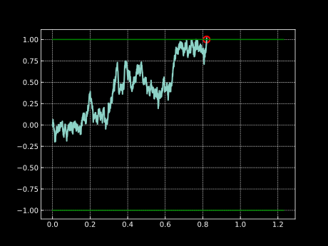

---
jupytext:
  formats: md:myst
  text_representation:
    extension: .md
    format_name: myst
    format_version: 0.13
    jupytext_version: 1.11.5
kernelspec:
  display_name: Python 3
  language: python
  name: python3
---

# Hitting Times of a Brownian Motion

<!--*Date Posted: 18 January 2025*-->

## Hitting time

Hitting time is a random variable $\tau_b$ defined as the first time that the observed stochastic process $X_t$ *hits* or *crosses* the level $b$:

$$\tau_b = \min\{t>0 : X_t \geq b\}$$

```{note}
Note that here we are providing a definition which is somewhat less general, because there could be 2 barriers (one above and one below, for example). The condition $X_t \geq b$ from above should be generalized to $X_t \in A$, where $A$ is the target set of values.
```

For instance, let us consider $X_t = W_t$, where $W_t$ is a Brownian motion ($W_t \sim \mathcal{N}(0,t)$). We simulate one sample path of $W_t$ where we are interested in when the process will hit wither of the barriers $b_1=1$ or $b_2=-1$:



If we do this many times and we record the times when the process crosses any of the barriers $b_1$ and $b_2$, then we will can get an estimate of the expected time to hit the barrier - i.e. $\mathbb{E}[{\tau_b}]$. This is very interesting and can be insightful, but we are interested in knowing a bit more about the behaviour of the random variable $\tau_b$. In the following sections we will derive the expression for the probability distribution of $\tau_b$ in the case of $X_t = W_t$.  


## Reflection principle

In theory of stochastic processes, the **reflection principle** tells us that if the Brownian motion $W_t$ reaches a certain level $b$ at time $s$, then for each path starting from the value $b$ and time $s$ has an equally likely path that is reflected against the level $b$. For visual understanding, consider the plot below:


Here we can see that once the original path reaches the level $b=1$, we reflect the path with respect to the level $b=1$ and we get the reflected path which is equally likely. This will be useful when deriving the expression for the probability distribution of $\tau_b$.

## Probability distribution of the hitting time

$$
\begin{split}
\mathbb{P}(W_t > b) &= \mathbb{P}(W_t > b, \tau_b < t)& \\
&= \mathbb{E}[\mathbb{1}_{\{W_t>b\}}\mathbb{1}_{\{\tau_b < t\}}] \\
&= \mathbb{E}[\mathbb{1}_{\{\tau_b < t\}} \mathbb{E}[\mathbb{1}_{\{W_t>b\}}|\tau_b = s, s < t, W_s = b]]
\end{split}
$$

Now we need to take care of the expression for the conditional expectation inside the outer expectation:

$$
\begin{split}
\mathbb{E}[\mathbb{1}_{\{W_t>b\}}|\tau_b = s, s < t, W_s = b] &= \mathbb{P}[W_t>b | \tau_b = s, s < t, W_s = b] \\
&= \mathbb{P}[W_t>W_s | \tau_b = s, s < t, W_s = b] \\
&= \mathbb{P}[W_t - W_s > 0| \tau_b = s, s < t, W_s = b] \\
\end{split}
$$

The increment $(W_t-W_s)$ of the Brownian motion is independent of all the information up to time $s$, so we can write:

$$
\mathbb{E}[\mathbb{1}_{\{W_t>b\}}|\tau_b = s, s < t, W_s = b] = \mathbb{P}[W_t - W_s > 0] = \frac{1}{2}
$$

This is the reflection principle we were mentioning earlier (each path has an equally likely path that is reflected with respect to the barrier $b$). We can now finish the derivation by going back to the original problem from above:

$$
\begin{split}
\mathbb{P}(W_t > b) &= \mathbb{E}[\mathbb{1}_{\{\tau_b < t\}} \mathbb{E}[\mathbb{1}_{\{W_t>b\}}|\tau_b = s, s < t, W_s = b]] \\
&= \mathbb{E}\left[\mathbb{1}_{\{\tau_b < t\}}\cdot\frac{1}{2}\right] \\
&= \frac{1}{2} \mathbb{P}(\tau_b < t) 
\end{split}
$$

And finally we get that the CDF of the hitting time $\tau_b$ is given by:

$$
F_{\tau_b}(t) = \mathbb{P}(\tau_b < t) = 2\cdot\mathbb{P}(W_t > b)
$$

## Maximum of the Brownian motion

We can now use this result and extend on it, namely we can find the distribution of the maximum $M_t$ of the Brownian motion. We define $M_t$ as

$$W^*_t = \sup_{s\leq t}\{W_s\}$$

To be more precise, we are interested in the following probability:

$$\mathbb{P}[W^*_t \geq b] = \mathbb{P}[\tau_b \leq t] = 2\cdot\mathbb{P}(W_t > b)$$

Which immediately gives us the expression for the CDF of $M_t$:

$$F_{W^*_t} = \mathbb{P}[W^*_t < b] = 1 - \mathbb{P}[W^*_t \geq b] = 1 - 2\cdot\mathbb{P}(W_t > b)$$

## Optional Stopping Theorem (OST)

In this section we will discuss in more detail the optional stopping theorem and it's usefulness. We start by reminding ourselves that the martingale property of a process tells us that the expected value of the process at some future time $t$ is equal to the current value of the process, that is

$$\mathbb{E}[X_t|X_s] = X_s$$

where $0<s<t$. That means that for time $s=0$ we have

$$\mathbb{E}[X_t] = X_0$$

Optional stopping theorem states that this still holds it time $t$ is a random variable: 

$$\mathbb{E}[X_{\tau}|X_s] = X_s$$

where $\tau$ is a random variable. This holds under certain conditions on $\tau$, which are omitted for brevity (you can read more on this [link](https://en.wikipedia.org/wiki/Optional_stopping_theorem)). While at first this does not look like a major thing, let us demonstrate the usefulness of this theorem on a few handpicked examples.

### Expected hitting time of $W_t$

The problem here consists of finding the expected time that the Brownian motion $W_t$ leaves the interval $[a,b]$, where $a>0$ and $b<0$, given that $W_0 = 0$. 

We want to use the OST, and to be able to do that, we need a martingale. In this first example this is easy as $W_t$ is already a martingale, so we know that we can write

$$\mathbb{E}[W_{\tau}] = W_0 = 0$$

Where $\tau$ is the hitting time of either of the barriers $a$ or $b$. Since our process can take only either value $a$ or $b$ at the hitting time $\tau$, we know that the following needs to hold

$$\mathbb{E}[W_{\tau}] = p_a\cdot a + p_b\cdot b = 0$$

Since we know that $p_a + p_b = 1$, we have a system of two equations which when solved gives the following result:

$$p_a = \frac{-b}{a-b}$$
$$p_b = \frac{a}{a-b}$$

This is nice, but we don't have the term involving $\tau$. For that we need to find another martingale and a good choice would be $W_t^2 - t$. 

$$\mathbb{E}[W_{\tau}^2 - \tau] = W_0^2 - 0 = 0$$

Given the linearity of the expectation we can get the following:

$$\mathbb{E}[\tau] = \mathbb{E}[W_{\tau}^2] = a^2 p_a + b^2 p_b = \frac{ab^2 - a^2b}{a-b} = \frac{ab(b-a)}{a-b} = -ab$$

For instance if we take $a=3$ and $b=-1$, the expected time to hit either of the barriers is $\mathbb{E}[\tau]=-3\cdot(-1) = 3$.

```{note}
Had the process been a generalized Brownian motion (Brownian motion with a drift), we would need to find a transformation of the process which is a martingale. We could efficiently do so by using Ito's lemma and make the drift go away. Then we could apply the OST on the transformed process which is now a martingale.
```

### Gambler's Ruin

Let us imagine a gambler which currently owns 6 euros and plays a gambling game where he pays 1 euro to play and if he wins he gets his euro back and an extra 1 euro as a reward, while if he loses, he loses his 1 euro he paid to play the game. The probabilities of winning and losing are both $\frac{1}{2}$. The gambler will leave the casino either when he loses all his money or if his wealth reaches 10 euros.

What is the probability that the gambler will leave the casino with 10 euros in his pocket?

Before we jump in and use the OST, we need to define a martingale that is useful for this problem. Let us denote the gambler's gain/loss with a random variable $S_n$:

$$S_n = X_1 + X_2 + \cdots + X_n$$

where $X_i$ is the outcome of the $i$-th game, which takes value $1$ with probability $\frac{1}{2}$ and value $-1$ with probability $\frac{1}{2}$. It is clear that $S_n$ is a martingale with expected value of zero. 

We can now utilize the OST and write:

$$\mathbb{E}[S_n] = 4\cdot p_{win} -6\cdot p_{loss} = 0$$

Similar to above we can get the probabilities of winning and losing:

$$p_{win} = \frac{-(-6)}{4+6} = 0.6$$

Pretty efficiently we have reached the final result. 

## Concluding notes

Hitting times are a very interesting topic in the theory of stochastic processes and can have many applications. We have shown that we can easily get the distribution of the hitting time $\tau_b$, maximum of the Brownian motion, and finally we have shown how to use the OST on two similar problems (discrete and continuous case). Hopefully you found this post insightful and maybe it motivated you to further explore this area of probability theory :)

## References

- [Alex Shkolnik lectures on YouTube](https://youtube.com/@alexshkolnik9671?si=RAtFdEH9LxsSfSGi)